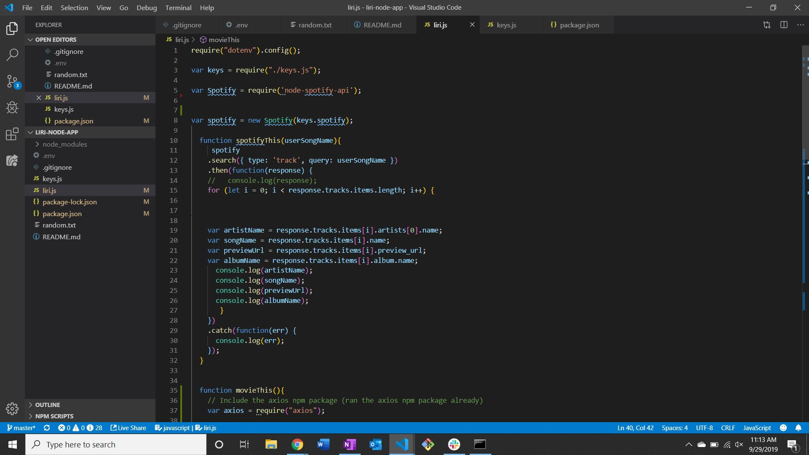
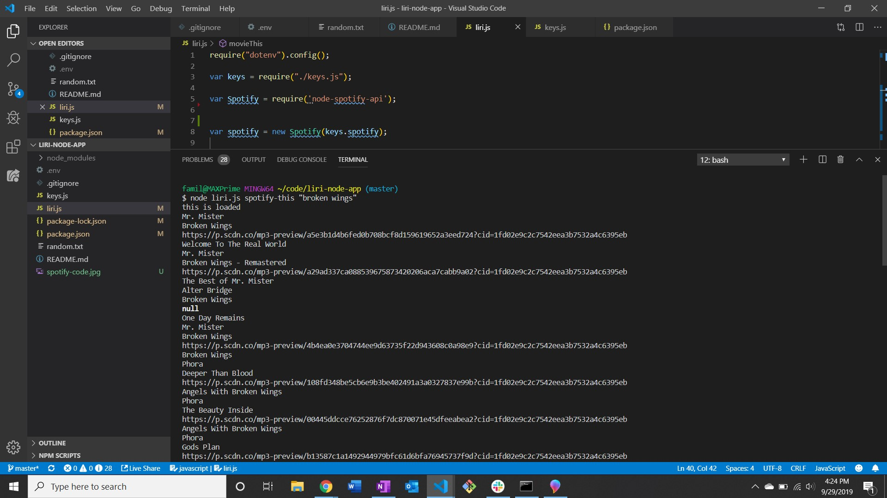
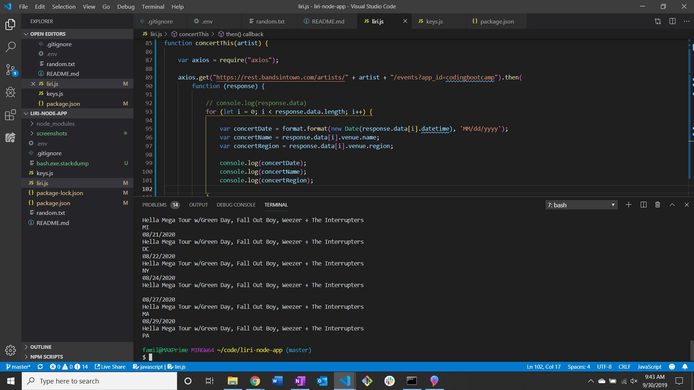
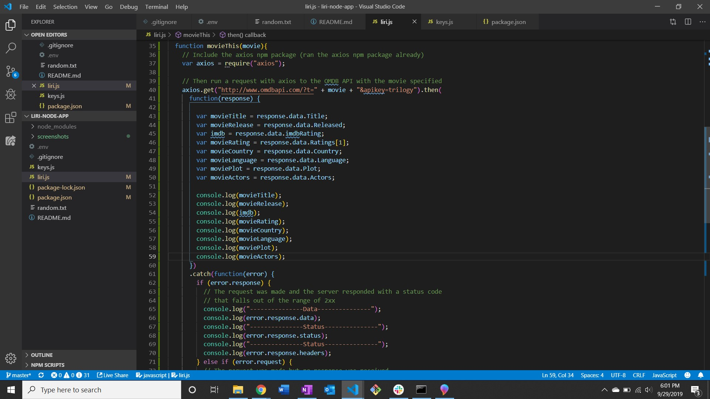
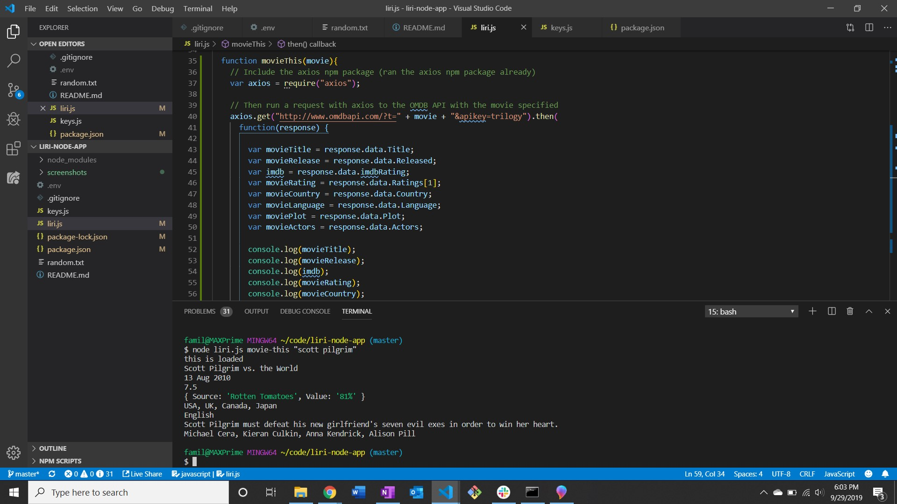

# liri-node-app
##   This app is designed to be a written version of what the app Siri accomplishes. Obviously Siri's depth of capability is far more than we'll be tackling for this project.

## The user will type specific commands into the bash/terminal and the app will take those commands and call the information from one of the specific API's used.

 

# The three API's used are Spotify, Bands in Town and OMDB.

## Spotify will grab the artist(s), the song's name, a preview link of the song from Spotify and the album that the song is from.

### Below is an image of the code for the spotify API.

### Using the command spotify-this and entering the song name, the user gets the below result.

 

## Bands in Town will find the name of the venue, venue location and the date of the Event.

### Below is an image of the code for the bands in town API.

### Using the command concert-this the user gets the below result.

 

## The final API, OMDB, will output the title of the movie, year the movie came out, the IMDB Rating of the movie, Rotten Tomatoes rating of the movie, the country where the movie was produced, the language of the movie, the plot of the movie and the actors in the movie.

### Below is an image of the code for the OMDB API.

### Using the command movie-this the user gets the below result.

